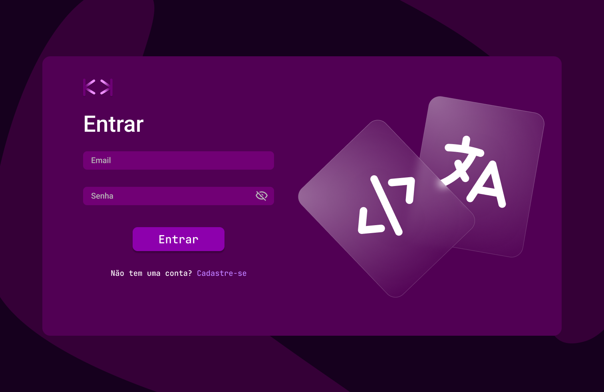
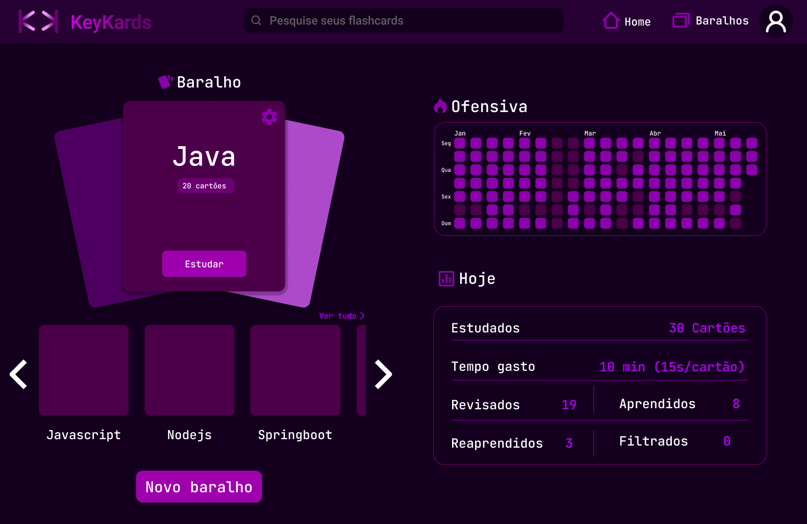

# KeyKards - A Flashcards App 💜

Esta é uma aplicação de flashcards. O objetivo é ajudar os usuários a estudar e memorizar informações de forma eficiente. A aplicação permite criar, editar e revisar flashcards personalizados.

## Status do Projeto
🚧 Em desenvolvimento 🚧

## Funcionalidades
- Criação de flashcards personalizados
- Edição de flashcards existentes
- Revisão de flashcards com base na curva do esquecimento de Ebbinghaus.
- Interface amigável e intuitiva

## Tecnologias Utilizadas
- **Frontend:** React, Typescript
- **Backend:** Node.js, Express
- **Banco de Dados:** Postgres

## Spoiler
### Login

###  Home

